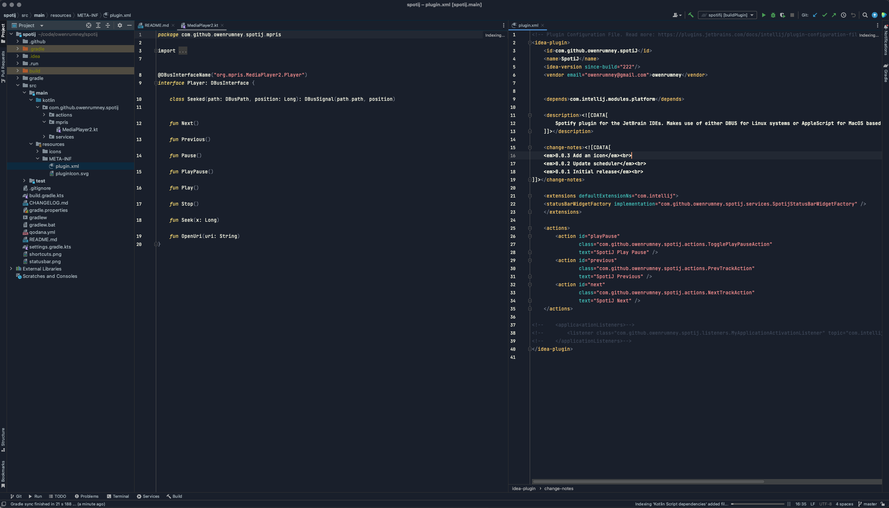

# nighthawk

<!-- Plugin description -->

A nice, clean simple dark plugin with a dark blue background and easy on the eye colours.

<!-- Plugin description end -->

## Installation

- Using IDE built-in plugin system:

  <kbd>Settings/Preferences</kbd> > <kbd>Plugins</kbd> > <kbd>Marketplace</kbd> > <kbd>Search for "nighthawk"</kbd> >
  <kbd>Install Plugin</kbd>
